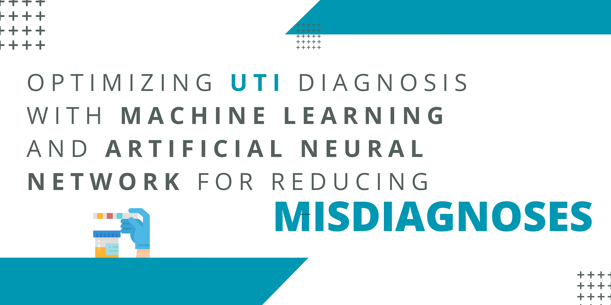

<h1 style='text-align: center;'>U.T.I Diagnosis Classification</h1>




<a href="https://visitorbadge.io/status?path=https%3A%2F%2Fgithub.com%2Fkr-agdeppa%2FUTI-Diagnosis-Classification"></a>

<p>In this repository, the researchers utilized a hybrid approach using five (5) machine learning models and one (1) deep learning model to tune, train and evaluate using labaled urinalysis tests results. This repository is based on the implementation of methodology of the researchers capstone entitled - <i>Optimizing UTI Diagnosis with Machine Learning and Artificial Neural Networks for Reducing Misdiagnoses</i> by Agapay, N.K., Agdeppa, K.R., Dabalos, D.G., and Virtudez, J.L.. Moreover, The models were trained and evaluated using Python 3.10.6 and NVIDIA T4 x2 from Kaggle.</p>

<h2>Dependencies</h2>

<p>The user needs to install the prerequisites.</p>

```
pip install -r requirements.txt
```

or

```
conda install --yes --file requirements.txt
```


<h2>Background</h2>

<p>The burden of Urinary tract infections (UTIs) extends beyond the healthcare system, as it significantly impacts individuals' quality of life and productivity (Medina et al., 2019). UTIs are a widespread and recurrent health problem that affects millions of individuals worldwide and can have various adverse effects on individuals, ranging from mild discomfort to severe complications. They can lead to significant morbidity and even mortality, especially among vulnerable populations such as the elderly, pregnant women, and individuals with compromised immune systems (Hooton, 2012). UTI symptoms can have a crucial impact on an individual's physical and emotional well-being, disrupting daily activities and sleep patterns. Moreover, UTI can affect an individual's productivity, leading to absences from work or school leading to decreased performance.</p>

<h2>Methodology</h2>

<p>The figure below illustrates the pipeline used for model selection and classification. The pipeline encompasses vital steps and processes for achieving unbiased classification results, including data exploration, data preparation, and model evaluation to ensure that the optimal model is selected for the system integration.</p>


